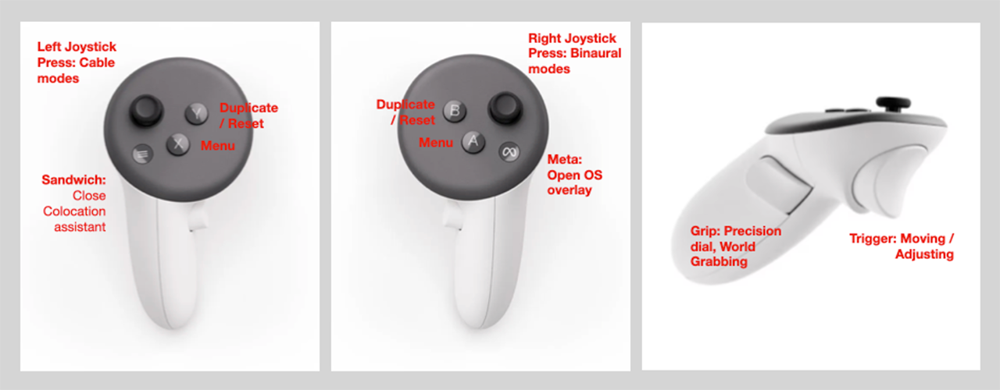

# OpenSoundLab Quickstart

## Controller mappings



*   Open menu: hold a controller in front of you and press the X or A button
*   Drag object: press and hold trigger buttons of either controller
*   Resize object: drag object with both controllers while holding triggers
*   Duplicate object: press and hold Y or B button while selecting an object
*   Delete object: open menu with X or A buttons, drag object into trash bin
*   Fine-tune dials: hold grab button before tuning a dial and let go only after exiting that dial
*   Move patch: hold both grab buttons outside of objects and drag the patch
*   Reset dial knob: press B or Y while in dial to reset to default value
*   Left joystick short press: select the previous HRTF subject
*   Left joystick long press: flip through straight, visualized and hidden cable modes
*   Right joystick short press: select the next HRTF subject
*   Right joystick long press: flip through binaural spatialization modes
*   Both joysticks inward: set background to white
*   Both joysticks outward: set background to passthrough
*   Both joysticks up: disable depth occlusion (virtual objects are always drawn on top of the passthrough)
*   Both joysticks down: enable depth occlusion (real-world geometry hides virtual objects; requires a depth-capable headset such as Quest 3)

## Binaural spatialization

*   There are two spatialization modes:
    *   Speaker: signals appear to come from connected Speaker objects
    *   All: every object with a mini-speaker will be spatialized
*   HRTF subjects can be cycled through with short joystick presses: left for previous and right for next
*   Spatialization modes can be cycled through by long pressing the right joystick

## General remarks

*   Master bus overload: if you overdrive the master output a warning will be shown
*   Record master bus: open menu and press the record button
    *   Recordings will appear in the `Samples/Sessions` folder
    *   Use ADB or SideQuest to copy the recordings to your computer
*   Please note that some modulation-oriented objects do not have built-in speakers and can therefore only be heard if connected to a mini-speaker further down the signal chain. For example, the Glide and AD modules do not have built-in speakers. Be aware that such DC signals can easily overload your audio bus.

## File management

If you want to upload new samples or download your recordings from the headset, follow these steps:

*   Connect your Quest via USB to your computer
*   Check in the headset if you have to trust the connection
*   On Windows you can use Windows Explorer for file transfer. On macOS you can use [OpenMTP](https://openmtp.ganeshrvel.com/).
*   Place your samples here: `/sdcard/Documents/OpenSoundLab/Samples/`
*   Only one folder depth is allowed, i.e. `Samples/subfolder/file.wav` is ok
*   You may use 44.1/48 kHz, 16/24-bit, mono/stereo WAV files
*   Recordings either go in the `Recordings` folder via Recorder device or `Sessions` folder via the recorder in the menu, depending on how you recorded them
*   Your save files are in `/sdcard/Documents/OpenSoundLab/Saves`

## Video recordings

The Quest headsets offer a screen recording feature. Using ADB you can change the quality settings of these recordings. You have to run these commands in a shell environment while the Quest is connected to your computer via USB. Please note: developer mode is needed for these. Settings are lost when power is cycled.

```bash
adb shell setprop debug.oculus.fullRateCapture 1
adb shell setprop debug.oculus.capture.width 1280
adb shell setprop debug.oculus.capture.height 720
adb shell setprop debug.oculus.capture.bitrate 10000000
adb shell setprop debug.oculus.capture.fps 60
```

Using the Quest's recording feature will [black out the mixed-reality passthrough](https://skarredghost.com/2021/09/05/record-videos-oculus-quest-passthrough-ar/). If you would like to include the passthrough rendition in your recording, use [scrcpy](https://github.com/Genymobile/scrcpy), for example with the following configuration. Unfortunately, no audio will be transmitted and recorded that way, but you can record your session in OSL or externally and align audio and video afterwards.

```bash
scrcpy --max-size 2560 --crop 1750:1900:0:0 --bit-rate 5M --max-fps 30 --display-buffer 120 --record out.mp4
```

## Known bugs and issues

*   Samples stay cached in memory even when tapes are removed. If you load many gigabytes worth of samples the app will crash.
*   If frame rates get low, try to reduce the amount of visible objects. For example, place objects all around you instead of only in front of you in order to lower the amount of draw calls through frustum culling.
